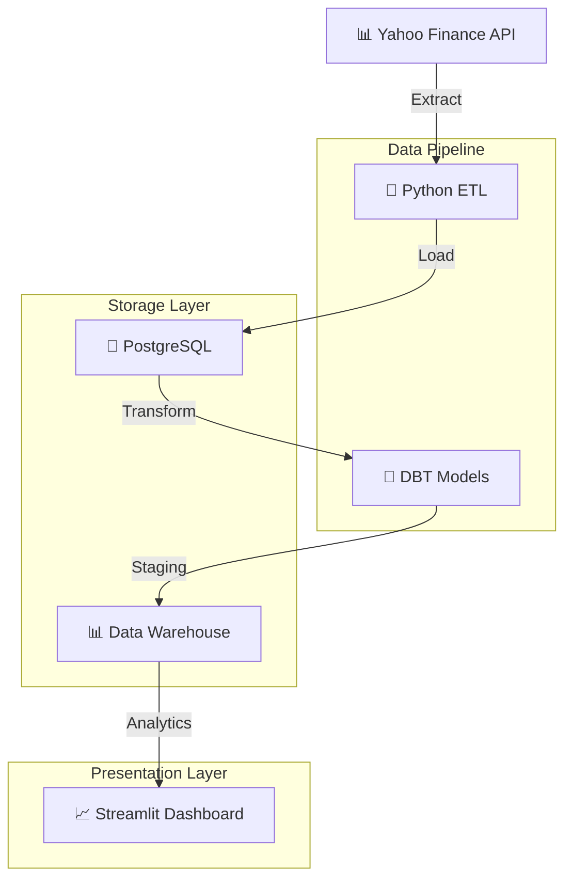

# 📊 Commodities Data Warehouse

[](https://python.org)
[](https://postgresql.org)
[](https://getdbt.com)
[](https://streamlit.io)

> **Modern data warehouse for commodities analysis with real-time monitoring**

## 🎯 Overview

Complete data warehouse solution for commodities analysis using **PostgreSQL**, **DBT**, **Python**, and **Streamlit**. Extract data from Yahoo Finance API, transform with SQL, and visualize in professional dashboards.

## 🏗️ Architecture



### Project Components

#### 1. **Extract & Load** (`src/`)
Responsible for extracting data from APIs and loading directly into PostgreSQL database.
- **Script**: `extract_load.py`
- **Function**: Fetches commodity data via Yahoo Finance API and loads into database
- **Features**: Error handling, data validation, automated scheduling

#### 2. **Transform** (`dbsales/`)
Uses DBT for data transformations:
- **Staging Models**: Data cleaning and standardization
- **Datamart Models**: Business metrics and aggregated analytics tables
- **Seeds**: CSV data loading for commodity movements
- **Tests**: Data quality and integrity validation

#### 3. **Dashboard** (Streamlit)
Visual interface for data analysis:
- **Interactive Visualizations**: Real-time charts and graphs
- **Commodity Data Tables**: Detailed data exploration
- **Trend Analysis**: Historical price and volume patterns
- **KPI Monitoring**: ROI, P&L, and investment tracking

### 🔄 Data Flow

```
Yahoo Finance API → Python ETL → PostgreSQL → DBT Transform → Data Warehouse → Streamlit Dashboard
```

#### **Detailed ETL Process:**

**1. Extract**
   - Fetches commodity data from external APIs (Yahoo Finance)
   - Collects price information, volumes, and timestamps
   - Handles API rate limits and error recovery

**2. Load**
   - Loads raw data into PostgreSQL staging tables
   - Maintains original data for audit trails
   - Ensures data consistency and integrity

**3. Transform**
   - DBT processes raw data through staging models
   - Creates clean, standardized staging tables
   - Generates final datamart tables for analysis
   - Applies business logic and calculations

**4. Visualize**
   - Streamlit dashboard consumes data from warehouse
   - Presents real-time KPIs and interactive visualizations
   - Enables data export and filtering capabilities

## 📈 Dashboard


**Key Features:**
- 💰 Real-time KPIs (ROI, P&L, Total Invested)
- 📊 Interactive charts with Plotly
- 🎛️ Advanced filtering system
- 📋 CSV export functionality

## 🔄 Data Lineage


**Pipeline Flow:**
1. **Extract**: Yahoo Finance API → Python
2. **Load**: PostgreSQL staging tables
3. **Transform**: DBT models (staging → datamart)
4. **Visualize**: Streamlit dashboard

## 🚀 Quick Start

```bash
# Clone repository
git clone https://github.com/yagosamu/data_warehouse_commodities.git
cd data_warehouse_commodities

# Setup environment
python -m venv venv
venv\Scripts\activate
pip install -r app/requirements.txt

# Configure database (.env file required)
python src/extract_load.py

# Run transformations
cd dbsales && dbt run

# Launch dashboard
cd ../app && streamlit run app.py
```

## 🛠️ Tech Stack

| Component | Technology | Purpose |
|-----------|------------|---------|
| **Extract** | Python + yfinance | API data extraction |
| **Storage** | PostgreSQL | Data warehouse |
| **Transform** | DBT | SQL transformations |
| **Visualize** | Streamlit + Plotly | Interactive dashboard |

## 📁 Structure

```
├── src/extract_load.py     # ETL pipeline
├── dbsales/               # DBT project
│   ├── models/staging/    # Data cleaning
│   └── models/datamart/   # Business metrics
├── app/app.py            # Streamlit dashboard
└── assets/               # Screenshots
```

## 👨‍💻 Author

**Yago Lopes** - [GitHub](https://github.com/yagosamu)

---

### 🇧🇷 [Versão em Português](README_PT.md)

---
*⭐ Star this repo if you found it helpful!*