# 📊 Commodities Data Warehouse

[](https://python.org)
[](https://postgresql.org)
[](https://getdbt.com)
[](https://streamlit.io)

> **Modern data warehouse for commodities analysis with real-time monitoring**

*How much did your company sell yesterday? If it takes you more than 3 seconds to answer, this project is for you!*

## 🎯 Overview

Complete data warehouse solution for commodities analysis using **PostgreSQL**, **DBT**, **Python**, and **Streamlit**. Extract data from Yahoo Finance API, transform with SQL, and visualize in professional dashboards.

## 🏗️ Architecture

```mermaid
graph TD
    A[📊 Yahoo Finance API] -->|Extract| B[🐍 Python ETL]
    B -->|Load| C[🐘 PostgreSQL]
    C -->|Transform| D[🔧 DBT Models]
    D -->|Staging| E[📊 Data Warehouse]
    E -->|Analytics| F[📈 Streamlit Dashboard]
    
    subgraph "Data Pipeline"
        B
        D
    end
    
    subgraph "Storage Layer"
        C
        E
    end
    
    subgraph "Presentation Layer"
        F
    end
```



## 📈 Dashboard


**Key Features:**
- 💰 Real-time KPIs (ROI, P&L, Total Invested)
- 📊 Interactive charts with Plotly
- 🎛️ Advanced filtering system
- 📋 CSV export functionality

## 🔄 Data Lineage


**Pipeline Flow:**
1. **Extract**: Yahoo Finance API → Python
2. **Load**: PostgreSQL staging tables
3. **Transform**: DBT models (staging → datamart)
4. **Visualize**: Streamlit dashboard

## 🚀 Quick Start

```bash
# Clone repository
git clone https://github.com/yagosamu/data_warehouse_commodities.git
cd data_warehouse_commodities

# Setup environment
python -m venv venv
venv\Scripts\activate
pip install -r app/requirements.txt

# Configure database (.env file required)
python src/extract_load.py

# Run transformations
cd dbsales && dbt run

# Launch dashboard
cd ../app && streamlit run app.py
```

## 🛠️ Tech Stack

| Component | Technology | Purpose |
|-----------|------------|---------|
| **Extract** | Python + yfinance | API data extraction |
| **Storage** | PostgreSQL | Data warehouse |
| **Transform** | DBT | SQL transformations |
| **Visualize** | Streamlit + Plotly | Interactive dashboard |

## 📁 Structure

```
├── src/extract_load.py     # ETL pipeline
├── dbsales/               # DBT project
│   ├── models/staging/    # Data cleaning
│   └── models/datamart/   # Business metrics
├── app/app.py            # Streamlit dashboard
└── assets/               # Screenshots
```

## 👨‍💻 Author

**Yago Lopes** - [GitHub](https://github.com/yagosamu)

---

### 🇧🇷 [Versão em Português](README_PT.md)

---
*⭐ Star this repo if you found it helpful!*