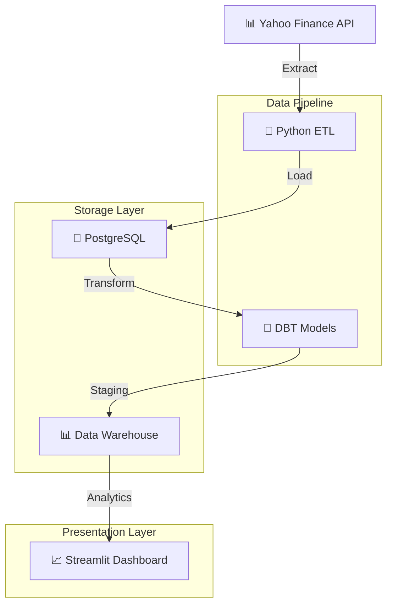

# 📊 Data Warehouse de Commodities

[](https://python.org)
[](https://postgresql.org)
[](https://getdbt.com)
[](https://streamlit.io)

> **Data warehouse moderno para análise de commodities com monitoramento em tempo real**

*Quanto sua empresa vendeu ontem? Se você demorar mais de 3 segundos para responder, este projeto é para você!*

## 🎯 Visão Geral

Solução completa de data warehouse para análise de commodities usando **PostgreSQL**, **DBT**, **Python** e **Streamlit**. Extrai dados da API do Yahoo Finance, transforma com SQL e visualiza em dashboards profissionais.

## 🏗️ Arquitetura



## 📈 Dashboard


**Funcionalidades Principais:**
- 💰 KPIs em tempo real (ROI, P&L, Total Investido)
- 📊 Gráficos interativos com Plotly
- 🎛️ Sistema de filtros avançado
- 📋 Funcionalidade de exportação CSV

## 🔄 Lineage dos Dados


**Fluxo do Pipeline:**
1. **Extract**: API Yahoo Finance → Python
2. **Load**: Tabelas staging PostgreSQL
3. **Transform**: Modelos DBT (staging → datamart)
4. **Visualize**: Dashboard Streamlit

## 🚀 Início Rápido

```bash
# Clone o repositório
git clone https://github.com/yagosamu/data_warehouse_commodities.git
cd data_warehouse_commodities

# Configure o ambiente
python -m venv venv
venv\Scripts\activate
pip install -r app/requirements.txt

# Configure o banco (arquivo .env necessário)
python src/extract_load.py

# Execute as transformações
cd dbsales && dbt run

# Inicie o dashboard
cd ../app && streamlit run app.py
```

## 🛠️ Stack Tecnológico

| Componente | Tecnologia | Propósito |
|------------|------------|-----------|
| **Extract** | Python + yfinance | Extração de dados da API |
| **Storage** | PostgreSQL | Data warehouse |
| **Transform** | DBT | Transformações SQL |
| **Visualize** | Streamlit + Plotly | Dashboard interativo |

## 📁 Estrutura

```
├── src/extract_load.py     # Pipeline ETL
├── dbsales/               # Projeto DBT
│   ├── models/staging/    # Limpeza de dados
│   └── models/datamart/   # Métricas de negócio
├── app/app.py            # Dashboard Streamlit
└── assets/               # Screenshots
```

## 👨‍💻 Autor

**Yago Lopes** - [GitHub](https://github.com/yagosamu)

---
*⭐ Dê uma estrela se este projeto foi útil!*

---

### 🇺🇸 [English Version](README.md)